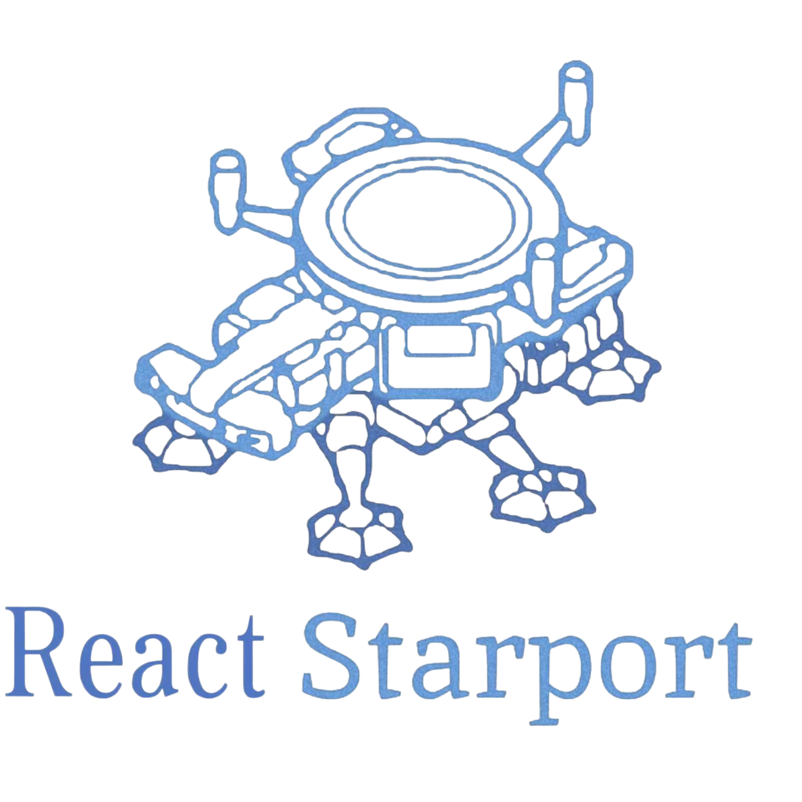
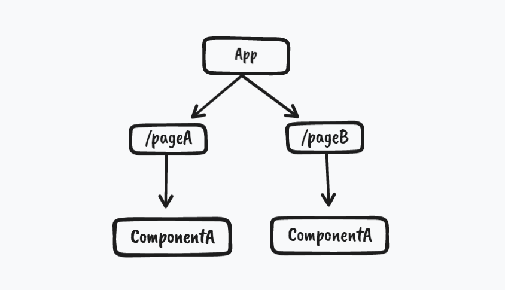
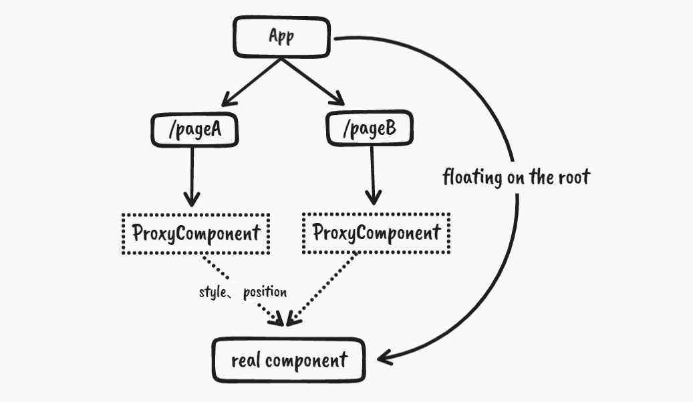
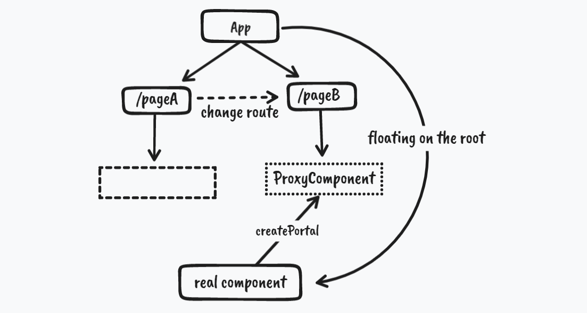

  

  🛰 Shared component across routes with animations

  <a href="https://react-starport-eta.vercel.app/" target="_blank">live demo</a>

  English | <a href="./README-zh.md" target="_blank">简体中文</a>

## origin

When we use the same component on different pages, the position, size, style, state, etc. of the same component may be different due to different page layouts and different UI designs. At this time, we may want to use different pages when routing jumps The same component has a `transition` animation to pass the same component smoothly, but the DOM structure is presented in the form of a tree, and components under different routes have different nodes, so when using the same component under different routes, it will still be Create two component instances

  

As shown above, the ComponentA component is used under both the pageA and pageB routes, then the component instances will be created twice on the two pages. When we jump from the pageA route to the pageB route, we will inevitably experience component unMount and reMount, execute the life cycle of the component, and the state in the component before the jump will also be lost.

Although we can use context or some global state management tools (mobx/redux) to store some states in components, and we can also use [FLIP](https://github.com/googlearchive/flipjs) to simulate animations between different components, but this implementation is not `elegant` enough, because the same component It will still render twice, or go through the life cycle of component unMount and reMount

## Plan

Design a `proxy component` floating on the root node to represent the expected position, style, etc. of the `real component`. After switching the route, the proxy component transfer the position, style and other information to the real component, and let it `fly` to the position of the proxy component in the form of tween animation

  

When the animation is over, transfer the real component to the corresponding proxy component through `createPortal`, and landing to the position corresponding to the node in the new route

  

With this `take off` and `landing` mechanism, the original DOM structure can be preserved through proxy components in different routes. When the route jumps, the real component `takes off` with the tween animation Form `fly` to the corresponding node position in the new route and then `landing`

- still coding
- 特别感谢女朋友帮忙 P 的 logo 图片
- Inspired by [Anthony Fu](https://github.com/antfu)

TODO-List

- [x] smooth animation
- [x] keepalive
- [x] clear any type
- [ ] save the home size
- [ ] about -> home, picture will float to the top and then restore its position
- [ ] add a picture, clicked reversal, save the state
